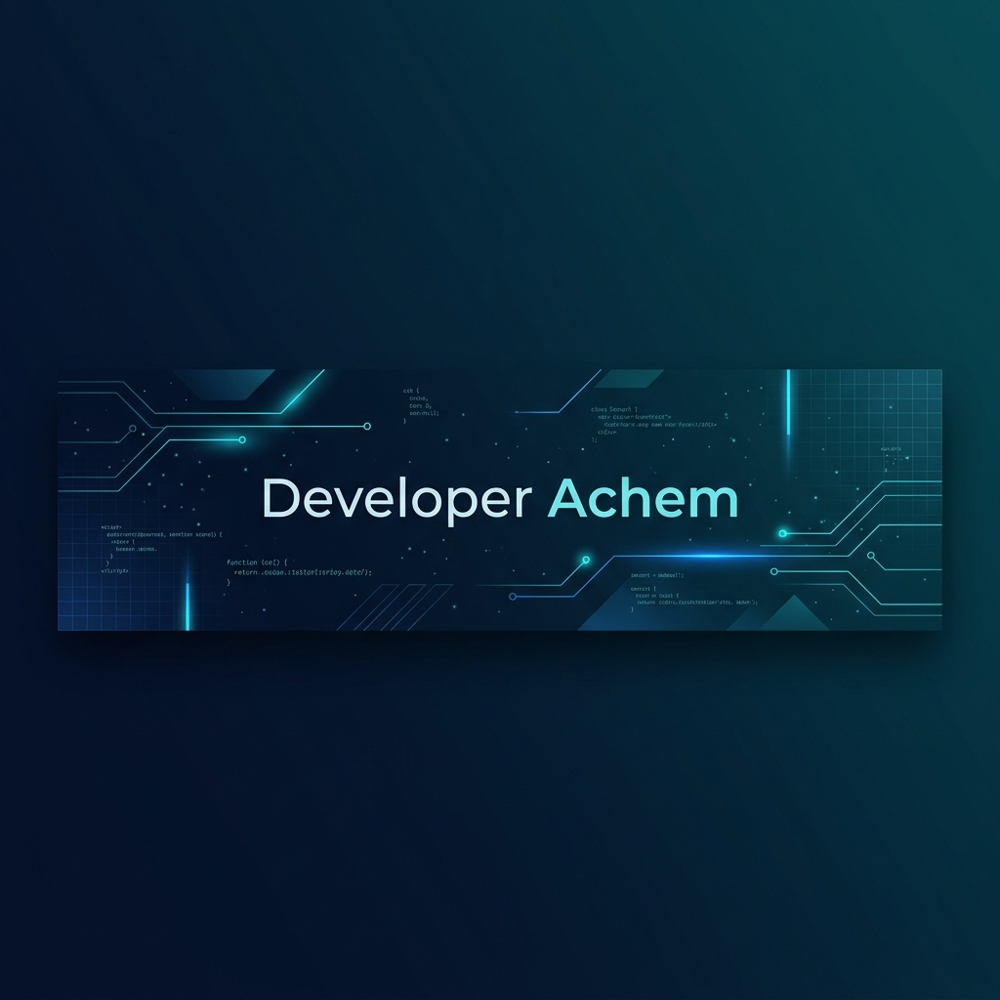

<!-- ═══════════════════════════════════════════════════════════════════════════ -->
<!--                         🚀 DEVELOPER ACHEM — GITHUB PROFILE               -->
<!-- ═══════════════════════════════════════════════════════════════════════════ -->

<div align="center">

<!-- ─── HEADER BANNER ──────────────────────────────────────────────────────── -->


<!-- ─── ANIMATED TYPING ────────────────────────────────────────────────────── -->
<br/>

[](https://git.io/typing-svg)

<!-- ─── PROFILE VIEWS & SOCIAL BADGES ──────────────────────────────────────── -->

<p>
  <a href="https://github.com/developerachem">
    
  </a>
  <a href="https://github.com/developerachem?tab=followers">
    
  </a>
  <a href="https://github.com/developerachem?tab=repositories&sort=stargazers">
    
  </a>
</p>

</div>

<!-- ─── HORIZONTAL DIVIDER ─────────────────────────────────────────────────── -->


<!-- ═══════════════════════════════════════════════════════════════════════════ -->
<!--                              ABOUT ME                                      -->
<!-- ═══════════════════════════════════════════════════════════════════════════ -->

##  &nbsp;About Me


```yaml
name: Developer Achem
located_in: Dhaka, Bangladesh 🇧🇩
current_role: Frontend Developer | MERN Stack Developer
company: Working on exciting projects ✨

education:
  - "Computer Science & Engineering"

focus_areas:
  - "Building scalable web applications"
  - "Cross-platform mobile development"
  - "Modern UI/UX design & implementation"
  - "RESTful API architecture"

life_motto: "Code is poetry — write it beautifully."
```

<br/>

- 🔭 &nbsp;I'm currently working on **Flux** & exciting open-source projects
- 🌱 &nbsp;I'm currently learning **Electron JS** & exploring AI integrations
- 💬 &nbsp;Ask me about **React, React Native, Next.js, Node.js, or anything Web**
- 📫 &nbsp;Reach me at **developerachem@gmail.com**
- 🌐 &nbsp;Check out my portfolio: **[developerachem.com](https://developerachem.com)**
- ⚡ &nbsp;Fun fact: I love discussing technology, software, coding, and innovative ideas!

<br clear="both"/>

<!-- ─── HORIZONTAL DIVIDER ─────────────────────────────────────────────────── -->


<!-- ═══════════════════════════════════════════════════════════════════════════ -->
<!--                         CONNECT WITH ME                                    -->
<!-- ═══════════════════════════════════════════════════════════════════════════ -->

##  &nbsp;Connect with Me

<div align="center">

<a href="https://developerachem.com" target="_blank">
  
</a>&nbsp;
<a href="https://linkedin.com/in/developer-achem" target="_blank">
  
</a>&nbsp;
<a href="https://twitter.com/developerachem" target="_blank">
  
</a>&nbsp;
<a href="https://facebook.com/developerachem" target="_blank">
  
</a>&nbsp;
<a href="https://instagram.com/developerachem" target="_blank">
  
</a>&nbsp;
<a href="mailto:developerachem@gmail.com" target="_blank">
  
</a>

</div>

<br/>

<!-- ─── HORIZONTAL DIVIDER ─────────────────────────────────────────────────── -->


<!-- ═══════════════════════════════════════════════════════════════════════════ -->
<!--                            TECH STACK                                      -->
<!-- ═══════════════════════════════════════════════════════════════════════════ -->

## 🛠️ &nbsp;Tech Arsenal

<div align="center">

### 💻 &nbsp;Frontend & UI


### ⚙️ &nbsp;Backend & Database


### 🧰 &nbsp;Tools & Platforms


</div>

<br/>

<!-- ─── HORIZONTAL DIVIDER ─────────────────────────────────────────────────── -->


<!-- ═══════════════════════════════════════════════════════════════════════════ -->
<!--                          GITHUB STATS                                      -->
<!-- ═══════════════════════════════════════════════════════════════════════════ -->

##  &nbsp;GitHub Analytics

<div align="center">

<p>
  
  
</p>

<p>
  
</p>

<!-- ─── CONTRIBUTION GRAPH ─────────────────────────────────────────────────── -->

<br/>


</div>

<br/>

<!-- ─── HORIZONTAL DIVIDER ─────────────────────────────────────────────────── -->


<!-- ═══════════════════════════════════════════════════════════════════════════ -->
<!--                          GITHUB TROPHIES                                   -->
<!-- ═══════════════════════════════════════════════════════════════════════════ -->

## 🏆 &nbsp;GitHub Trophies

<div align="center">


</div>

<br/>

<!-- ─── HORIZONTAL DIVIDER ─────────────────────────────────────────────────── -->


<!-- ═══════════════════════════════════════════════════════════════════════════ -->
<!--                         FEATURED PROJECTS                                  -->
<!-- ═══════════════════════════════════════════════════════════════════════════ -->

## 🚀 &nbsp;Featured Projects

<div align="center">

<a href="https://github.com/developerachem/Eridu">
  
</a>&nbsp;
<a href="https://github.com/developerachem/looping">
  
</a>

<a href="https://github.com/developerachem/challenge_blur_us">
  
</a>&nbsp;
<a href="https://github.com/developerachem/class-7-assignment-4">
  
</a>

</div>

<br/>

<!-- ─── HORIZONTAL DIVIDER ─────────────────────────────────────────────────── -->


<!-- ═══════════════════════════════════════════════════════════════════════════ -->
<!--                      SNAKE CONTRIBUTION GRAPH                              -->
<!-- ═══════════════════════════════════════════════════════════════════════════ -->

## 🐍 &nbsp;Contribution Snake

<div align="center">

<picture>
  <source media="(prefers-color-scheme: dark)" srcset="https://raw.githubusercontent.com/developerachem/developerachem/output/github-snake-dark.svg" />
  <source media="(prefers-color-scheme: light)" srcset="https://raw.githubusercontent.com/developerachem/developerachem/output/github-snake.svg" />
  
</picture>

</div>

<br/>

<!-- ─── HORIZONTAL DIVIDER ─────────────────────────────────────────────────── -->


<!-- ═══════════════════════════════════════════════════════════════════════════ -->
<!--                        SPOTIFY / CURRENT VIBES                            -->
<!-- ═══════════════════════════════════════════════════════════════════════════ -->

## 💡 &nbsp;Random Dev Quote

<div align="center">


</div>

<br/>

<!-- ═══════════════════════════════════════════════════════════════════════════ -->
<!--                            FOOTER                                          -->
<!-- ═══════════════════════════════════════════════════════════════════════════ -->

<div align="center">


</div>

<!-- ═══════════════════════════════════════════════════════════════════════════ -->
<!--                         END OF README                                      -->
<!-- ═══════════════════════════════════════════════════════════════════════════ -->
